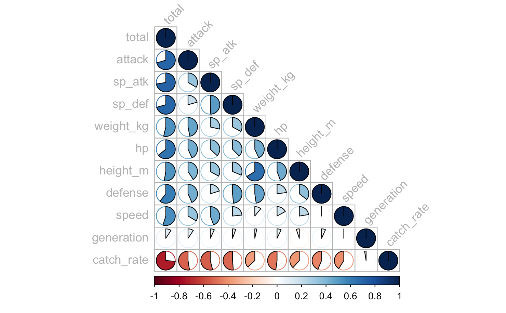
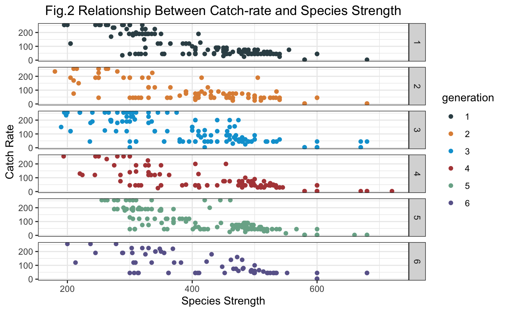
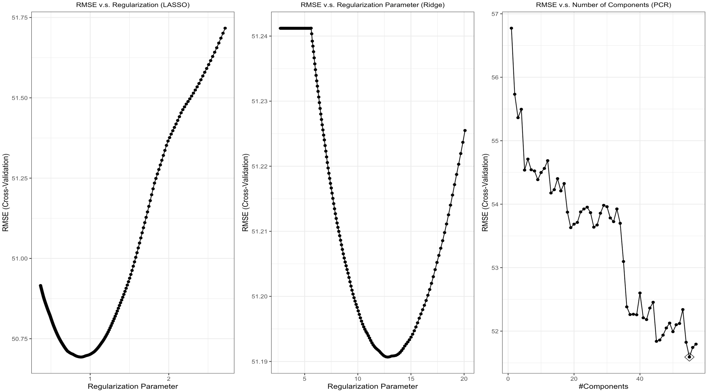
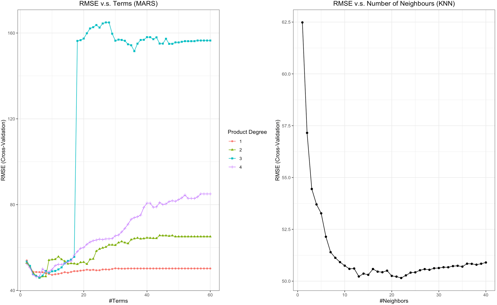
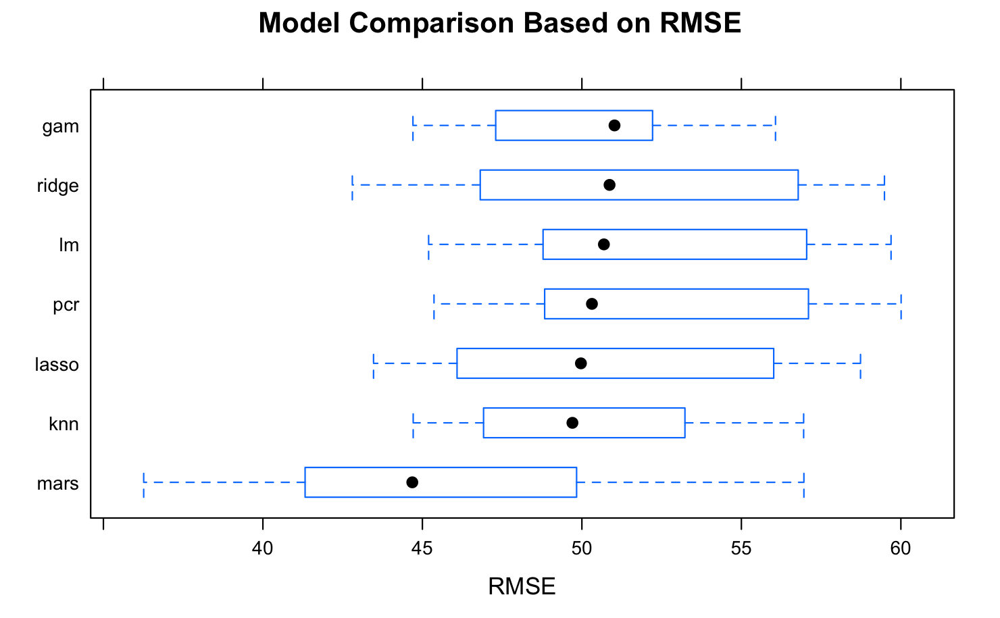
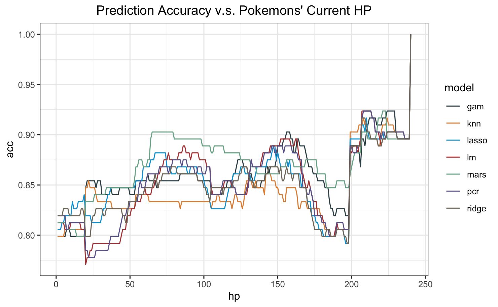

```{r setup, include=FALSE}
knitr::opts_chunk$set(echo = TRUE)
library(tidyverse)
```


# Introduction

For a large number of people, they must have heard of Pikachu, a famous member of the Pokémon family. Pokémon - the imaginary creatures in a series of games created by The Pokemon Company, has played a siginificant role in many people's childhood. The variety of appearance, vivid characterisitcs and detailed design make this IP fascinating. In the games, one of the goals is to catch and train as many as pokemons. However, finshing this task seems to be challenging since the probability of catching each pokemon is based not only on pokemons' features but also on a random number generation process. This makes the actual probability hard to calculate and sometimes brings difficulties to trainers' decision making.

Among the factors that are related to the actual probability, `catch rate` is an important parameter that directly matters before a random number generation process begins. The probability of catching a pokemon before a random number is generated is officially defined as `modified catch rate`.
Therefore, knowing `catch rate` is useful in determining the `modified catch rate`, which is the first-stage probability of catching a pokemon. Although we have an official table listing all of the `catch rates` for each pokemon, we don't know the exact principle of how the values are designed. Investigating the rules for `catch rate` could be an interesting topic. In this project, our goal is to investigate the relationship between the `catch rate` and other pokemon stats by building predictive machine learning models. 


# Dataset

## Overview

The data source is from https://www.kaggle.com/alopez247/pokemon. The original dataset includes 721 observations with 18 variables. These are all the pokemons in the first 6 generations. The response here is the `catch rate` while the predictors are `attack`, `special attack`, `defense`, `weight`, `height`, `probalibity of being male`,`body style`, `type` and other features. By constructing and comparing several regression models, we are able to predict the `catch rate` of every pokemon and hence the `modified catch rate`. We calculated the `modified catch rate` using the rules in Generation 3 since this generation is the most popular one among children and adults. The `modified catch rate` can be calculated via the following formula:

$$
Modified\ Catch\ Rate = \frac{(3*HP_{max} - 2*HP_{current})*rate*bonus_{ball}}{3*HP_{max}} *bonus_{status}
$$


Where:

$HP_{max}$ is the number of hit points the pokemon has at full health.
$HP_{current}$ is the number of hit points the pokemon has at the moment.
$rate$ is the catch rate in the original dataset.
$bonus_{ball}$ is the multiplier for the Poké Ball used.
$bonus_{status}$ is the multiplier for any status condition the pokemon has.

If $Modified\ Catch\  Rate>255$, then the pokemon can be absolutely caught. Otherwise, a random number generator will then work to determine the Poké Ball's shake probability which influences the capture probability. Determination of the shake probability involves a random number generator is beyond the scope of this project.

## Data preparation

Some classic continuous features of pokemons are related to the `catch rate` as the correlation plot shows(**Fig. 1**). Apart from these continuous features, categorical features such as `type_1`, `color`, `body style` were also included for the regression models. Some pokemons have two types while others only have one but usually `type_1` is representative enough for depicting a specific pokemon. Therefore, we dropped `type_2`. Note that the predictor `total`(`species strength`) is the sum of `hp`, `attack`, `defense`, `sp_atk`, `sp_def`, `speed`. We hypothesized that each element of the species strength was differently correlated to `catch rate`, and thus kept both `specis strength` and the six elements. It's interesting to see that the  `catch rate` is distributed similarly between different generations(**Fig. 2**). This supports our hypothesis that there should be some prinple of defining the `catch rate`.

The original dataset was randomly divided into a training set(n=577) and a validation set(n=144). A 10-fold cross validation process was applied for tuning parameters of all the models. 


```{r,include=FALSE}
set.seed(886)
data = read_csv('./data/pokemon/pokemon.csv') %>% 
  janitor::clean_names() %>%
  #select(-total) %>% #-hp,-attack,-defense,-sp_atk,-sp_def,-speed
  select(-number,-name,-type_2,-egg_group_2,-egg_group_1) %>%
  mutate(pr_male = ifelse(is.na(pr_male), -1, pr_male),
         generation = factor(generation))

index = sample(1:nrow(data),replace = F)
data = data[index,]

train = sample_frac(data,size = 0.8, replace = F)# training set 

validation = sample_frac(data,size = 0.2, replace = F) # validation  set


train_x = model.matrix(catch_rate ~ . , train)[,-1]
train_y = train$catch_rate
val_x = model.matrix(catch_rate ~. ,validation)[,-1]
val_y = validation$catch_rate
```

# Models

In the following regression models, the included predictors are `r names(data)[-17]`. The applied regression models were linear models including Least Squared Linear Regression, LASSO Linear Regression, Ridge Regression, Principle Component Regression and non-linear models including General Additive Model, Multiple Adaptive Regression Splines, K-NN.

## Linear Models

The assumption of linear models includes independency, normality, homoscedasticity and linearity. Observations are assumed to be independent to each other. The error terms should independently identically follow a normal distribution with a constant variance.

### Least Squared Linear Regression

We included all of the 17 predictors in the least squared linear model. This model is easy to conduct and interpret but sometimes not helpful when the linear relationship is not clear enough. According to the Gauss-Markov theorem, the estimators for the linear model are the best unbiased ones. Based on the regression results, we infer that certatin pokemon types(poison), body_styles, species strength and probability of being male are closely related to `catch rate`.

### LASSO Linear Regression

LASSO Linear Regression model uses L1 regularization technique to penalize the coefficients in order to improve the prediction accuracy and interpretability of the regression model. The best tunning parameter $\lambda = 0.8819427$ was picked from a grid of $\lambda$'s($e^{-1}\sim e^{1}$) via a 10-fold cross validation. All of the variables were initally included. The penalization term make the coefficients of certain pokemon `types`, `colors` and `body styles` shrink into 0. Also, `Height`, `weight` and `mega-evolution` are recognized as weak predictors with coefficients equal to 0(**Fig. 3**).

### Ridge Regression

Similarly to the LASSO model, all of the variables were initially included. However, this model uses L2 regularization technique to penalize the coefficients. The best tunning parameter $\lambda = 12.77818$ was picked from a grid of $\lambda$'s($e^{1}\sim e^{3}$) through a 10-fold cross validation. The model kept `has_gender`,`weight`, `height`,`pr_male`,`mega_evolution`, `body_styles` and the `yellow color` as predictors(**Fig. 3**).


### Principle Component Regression(PCR)

Principle component regression is an unsupervised method to model data. The tuning parameter here is the number of the components. The best tune is $n=55$ (**Fig. 3**).


## Non-linear Models

### General Additive Model(GAM)

**Fig. 4** shows that the relationship between `catch rate` and species strength(or other stats) might not strictly be a linear pattern. Therefore, a non-linear model called GAM was applied for prediction. Splines were applied to all of the numeric predictors except the probability of being male. The fitted model shows that `height`,`sp_def`,`hp`,`attack`,`speed`,`sp_atk`,`defense` are the statistically significant non-linear predictors.


### Multiple Adaptive Regression Splines(MARS)

We conducted a 10-fold cross validation to get the best tuning parameters of the MARS model. The tunning parameters of the model are the number of modelling parameters and the degree of interaction. Given the design of the values in pokemon system is extremely complex, we set the degree of interaction as 1 to 3 and the number of modeling parameters as 2 to 60 before cross validation. The best tunes for the model is `interaction degree = 2 and nprune = 6` (**Fig. 4**).

### KNN

All of the 17 predictors were included in the KNN model. The tunning parameter in the KNN model is the value of K. RMSE was used to select the optimal model using the smallest value. The final value used for the model was k = 22 (**Fig. 4**).

## Model Comparison

The resampling RMSE, MAE and $R^2$ for each model was obtained via `caret::resamples()`. By choosing the model with the lowest RMSE, we selected the MARS model as our final model for predicting `catch rate`. The MARS model also performed the best among all of the linear and non-linear models when using MAE and $R^2$ as the criterion. However, even though the MARS performed much better than other models, its average RMSE(average RMSE = 45.8) in test sets is still large when we consider the range of the response(0~255). We will then discuss whether this will influence a lot on the final prediction(**Fig. 5**).  


# Discussion

Even for the best regression model the RMSE is still around 45, seeming to be large. In fact, however, the first-stage probability is a `modified catch rate` which will be compared with the upper bound value(255). The influence of such large RMSE would be mitigated just because the `catch rate` will finally be scaled by `HP`(see Eq.1). 

It is realistic that trainers are always not able to determine the $HP_{current}$ of a pokemon. With $HP_{current}$ changed, the `modified catch rate` will also change greatly. Hence, we cannot promise MARS is always the best model to predict the `modified catch rate`. Simply choosing model based on metrics might be hazardous for a trainer with limited number of poke-balls. To address this problem, we conducted a simulation under different scenarios of a wild pokemon's $HP_{current}$. In the simulation, We assumed a wild pokemon's $HP_{max}$ to be 240, and calculated the prediction accuracy of different models under the scenarios where $HP_{current}$ increases from 1 to 240. We also assumed that the status of the pokemon was `asleep` and we used the `great poke-ball` to capture it. The result in **Fi.g 6** shows that MARS is not always the best in prediction as $HP_{current}$ changes. It is clear that when $HP_{current}$ lies in [50,125] and [175,200], MARS is a good model for prediction. Otherwise, other models work better. It is credible that the accuracy of all the models converge to 1 when $HP_{current} = HP_{max}$ because the pokemons are always hard to be captured when they get full health points and thus the results are easy to be correctly predicted. Although ordinary trainers always tend to capture pokemons under a low $HP_{current}$,
the variation of the prediction accuracy can still be a guideline for some crazy statistical pokemon trainers.


# Conclusion

In this project, we built several regression models to predict a pokemon's `catch rate`, which is an important parameter for determining the capture probability. We tuned the models and selected the best model for prediction. However, a more realistic and practical way to do the prediction is choosing different models given the different stages of $HP_{current}$. We simulated a series of scenarios in order to provide a guideline for maximizing the probability of capturing everyone's dream pokemon.


\pagebreak



\center __Fig. 1 Correlation between numeric predictors__



\center __Fig. 2 Relationship between Catch-rate and Species Strength__



\center __Fig. 3 Tunning Parameters for Linear Models__
 
 
 \center __Fig. 4 Tunning Parameters for Non-linear Models__
 
 
 
  \center __Fig. 5 Model Comparison Based on RMSE__
  
  
  
  
  \center __Fig. 6 Prediction Accuracy v.s. Pokemons' Current HP__
  

